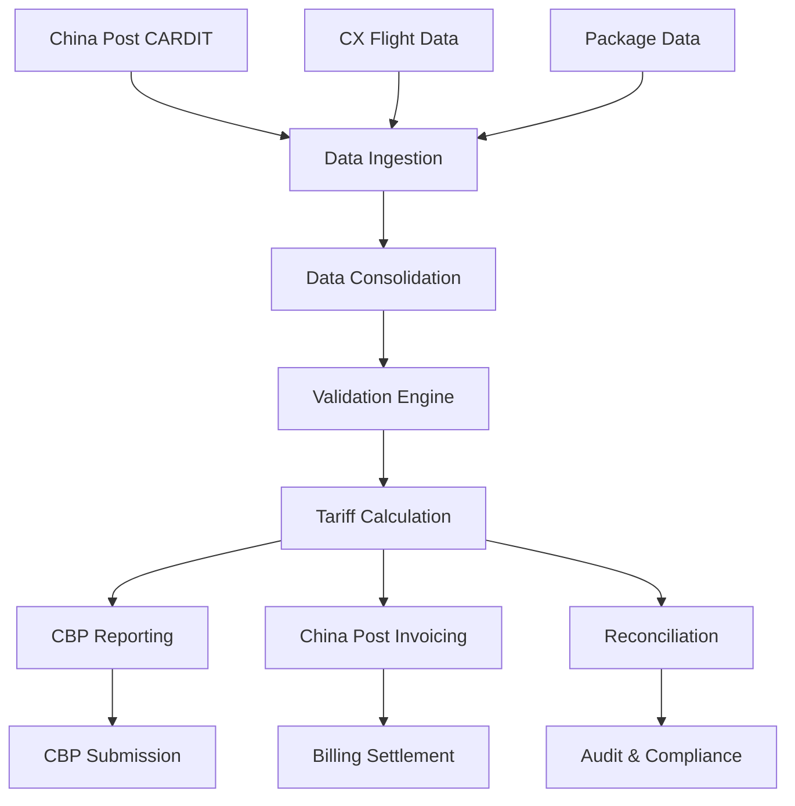

# 🛩️ Cathay Pacific Cargo - US Tariff Management System

[](https://www.cathaypacific.com)
[](https://typescriptlang.org)
[](https://reactjs.org)
[](https://vitejs.dev)

A comprehensive solution for managing US Customs and Border Protection (CBP) tariff compliance for Cathay Pacific Cargo's international mail services from China and Hong Kong to the United States.

## 📋 Table of Contents

- [🚀 Quick Start](#-quick-start)
- [📖 Overview](#-overview)
- [✨ Key Features](#-key-features)
- [🏗️ Architecture](#️-architecture)
- [🛠️ Technical Stack](#️-technical-stack)
- [⚙️ Installation](#️-installation)
- [🔧 Development](#-development)
- [📊 Data Flow](#-data-flow)
- [🧪 Testing](#-testing)
- [🚀 Deployment](#-deployment)
- [📝 API Documentation](#-api-documentation)
- [🤝 Contributing](#-contributing)

## 🚀 Quick Start

```bash
# Clone the repository
git clone <repository-url>
cd CathayCargoMailSolution

# Frontend setup
cd frontend
npm install
npm run dev

# Backend setup (in another terminal)
cd backend
pip install -r requirements.txt
python app.py
```

Open [http://localhost:3000](http://localhost:3000) to view the application.

## 📖 Overview

### Business Context

The **Cathay Mail** product transports mail for postal authorities (China Post, HK Post, USPS, etc.) using Cathay's network. Starting April 2, 2025, U.S. Customs and Border Protection (CBP) requires carriers to remit payment of duties on international postal packages from China or Hong Kong entering the United States.

### Regulatory Requirements

- **Duty Rate**: 54% of goods' value in USD
- **Scope**: All international postal packages from PRC or Hong Kong to the US
- **Reporting**: Mandatory reports to CBP with total packages and duty amounts
- **Settlement**: Billing and reconciliation processes with China Post

### Problem Statement

Cathay Cargo currently lacks:
- ✅ **Data Systems**: Essential shipment information (packet tracking IDs, values)
- ✅ **Validation Processes**: Verify accepted vs. flown shipments
- ✅ **Financial Settlement**: CBP tariff billing and China Post reconciliation

## ✨ Key Features

### 📊 Data Management
- **Data Ingestion**: Upload and process CARDIT and AWB Master files
- **Data Consolidation**: Merge postal and flight data for complete tracking
- **Validation Engine**: Comprehensive data validation with error reporting

### 💰 Tariff Processing
- **Automatic Calculation**: 54% tariff rate on declared package values
- **Multi-Currency Support**: Handle various currencies with conversion
- **Exception Handling**: Manage exempt countries and special rates

### 📋 Compliance Reporting
- **CBP Worksheets**: Generate mandatory transported package reports
- **China Post Invoicing**: Create billing documents for tariff charges
- **Audit Trail**: Complete tracking of all processed shipments

### 🔄 Reconciliation
- **Flight Matching**: Verify packages against actual flight data
- **Discrepancy Detection**: Identify unmatched or inconsistent shipments
- **Settlement Support**: Facilitate payment processes with postal authorities

### 📈 Analytics & Monitoring
- **Real-time Dashboard**: Overview of operations and key metrics
- **Trend Analysis**: Historical data and growth patterns
- **Alert System**: Notifications for compliance issues and deadlines

## 🏗️ Architecture

### Data Hierarchy

```
📦 MAWB/AWB Level (Consignment)
├── 🏷️ PAWB# 128-xxxxxxxx (from CARDIT)
├── 📄 RESDIT Messages (R74, R24, R21)
└── ✈️ Physical shipment on same flight/OD/product

    📮 Receptacle Level (Mail Bag)
    ├── 🔢 29-alphanumeric identifier
    ├── 📦 Can be consolidated bag or individual package
    └── 🔒 Sealed by Post Office (airlines cannot open)

        📦 Package Level (Individual Items)
        ├── 👤 Sender/Receiver information
        ├── 📍 Tracking numbers (Post Office managed)
        └── 💰 Declared value for tariff calculation
```

### System Components



## 🛠️ Technical Stack

### Frontend
- **Framework**: React 18 with TypeScript
- **Build Tool**: Vite 4
- **Styling**: Tailwind CSS 3 with custom Cathay Pacific theme
- **State Management**: TanStack Query for server state
- **Routing**: React Router v6
- **UI Components**: Headless UI + Lucide React icons
- **Forms**: React Hook Form with validation
- **Charts**: Recharts for data visualization

### Backend
- **Runtime**: Python 3.9+ with Flask
- **Data Processing**: Pandas for Excel/CSV manipulation
- **Database**: PostgreSQL (production) / SQLite (development)
- **File Handling**: Openpyxl for Excel processing
- **API**: RESTful endpoints with JSON responses
- **Validation**: Marshmallow schemas

### Development Tools
- **Package Manager**: npm (frontend) / pip (backend)
- **Linting**: ESLint + Prettier (frontend) / Black (backend)
- **Type Checking**: TypeScript (frontend) / mypy (backend)
- **Testing**: Jest + Testing Library (frontend) / pytest (backend)

## ⚙️ Installation

### Prerequisites

- **Node.js** 18+ and npm
- **Python** 3.9+ and pip
- **Git** for version control

### Frontend Setup

```bash
cd frontend

# Install dependencies
npm install

# Install additional development tools (optional)
npm install -D @types/node

# Verify installation
npm run build
```

### Backend Setup

```bash
cd backend

# Create virtual environment (recommended)
python -m venv venv
source venv/bin/activate  # On Windows: venv\Scripts\activate

# Install dependencies
pip install -r requirements.txt

# Set up environment variables
cp .env.example .env
# Edit .env with your configuration

# Initialize database (if applicable)
python init_db.py
```

## 🔧 Development

### Available Scripts

#### Frontend
```bash
npm run dev          # Start development server (http://localhost:3000)
npm run build        # Build for production
npm run preview      # Preview production build
npm run lint         # Run ESLint
npm run lint:fix     # Fix linting issues
npm run type-check   # Run TypeScript compiler check
```

#### Backend
```bash
python app.py        # Start Flask development server (http://localhost:5000)
python -m pytest    # Run tests
python -m black .    # Format code
python -m mypy .     # Type checking
```

### Environment Configuration

#### Frontend (.env)
```env
VITE_API_BASE_URL=http://localhost:5000
VITE_APP_VERSION=1.0.0
```

#### Backend (.env)
```env
FLASK_ENV=development
DATABASE_URL=sqlite:///cathay_cargo.db
SECRET_KEY=your-secret-key-here
CBP_API_ENDPOINT=https://cbp-api-endpoint
CHINA_POST_API_ENDPOINT=https://china-post-api
```

## 📊 Data Flow

### Input Files
1. **China Post CARDIT Data**
   - Format: Excel/CSV
   - Contains: Receptacle IDs, package counts, postal authority info
   - Frequency: Daily uploads

2. **CX Flight Data (AWB Master)**
   - Format: Excel/CSV
   - Contains: Flight details, AWB numbers, flown indicators
   - Frequency: Real-time updates

### Processing Pipeline

```
📥 File Upload → 🔍 Validation → 🔄 Data Merge → 💰 Tariff Calc → 📊 Report Generation
```

1. **Upload & Validation**: Files processed with comprehensive error checking
2. **Data Consolidation**: CARDIT and AWB data merged by receptacle/package IDs
3. **Tariff Calculation**: 54% duty applied to declared values
4. **Report Generation**: CBP worksheets and China Post invoices created
5. **Reconciliation**: Accepted vs. flown shipments validated

### Output Files
1. **CBP Transported Package Worksheet**
   - Format: Excel (CBP template format)
   - Contains: Package counts, total tariff amounts, carrier details
   - Submission: Quarterly to CBP

2. **China Post Invoice & Supporting Data**
   - Format: Excel/PDF
   - Contains: Billable tariff amounts, package details, acceptance dates
   - Purpose: Settlement with China Post

## 🧪 Testing

### Frontend Testing
```bash
npm run test              # Run all tests
npm run test:watch        # Run tests in watch mode
npm run test:coverage     # Generate coverage report
```

### Backend Testing
```bash
python -m pytest                    # Run all tests
python -m pytest --cov=.           # With coverage
python -m pytest tests/unit/       # Unit tests only
python -m pytest tests/integration/ # Integration tests only
```

### Test Structure
```
tests/
├── frontend/
│   ├── components/
│   ├── pages/
│   └── utils/
└── backend/
    ├── unit/
    ├── integration/
    └── fixtures/
```

## 🚀 Deployment

### Production Build

```bash
# Frontend
npm run build
# Files generated in dist/

# Backend
pip install gunicorn
gunicorn -w 4 -b 0.0.0.0:5000 app:app
```

### Environment Variables (Production)
- Set `NODE_ENV=production` for frontend
- Set `FLASK_ENV=production` for backend
- Configure production database URLs
- Set up proper CORS origins

### Docker Support (Optional)
```dockerfile
# Example Dockerfile for frontend
FROM node:18-alpine
WORKDIR /app
COPY package*.json ./
RUN npm ci --only=production
COPY . .
RUN npm run build
EXPOSE 3000
CMD ["npm", "run", "preview"]
```

## 📝 API Documentation

### Base URL
- Development: `http://localhost:5000/api`
- Production: `https://your-domain.com/api`

### Key Endpoints

| Method | Endpoint | Description |
|--------|----------|-------------|
| `GET` | `/dashboard/stats` | Dashboard statistics |
| `POST` | `/files/upload` | Upload CARDIT/AWB files |
| `GET` | `/shipments` | List shipments with filters |
| `POST` | `/reports/cbp` | Generate CBP report |
| `POST` | `/reports/china-post` | Generate China Post invoice |
| `GET` | `/reconciliation` | Reconciliation status |

### Response Format
```json
{
  "success": true,
  "data": { ... },
  "message": "Operation completed successfully",
  "errors": []
}
```

## 🤝 Contributing

### Development Workflow
1. Fork the repository
2. Create a feature branch (`git checkout -b feature/amazing-feature`)
3. Make your changes
4. Run tests (`npm test` and `pytest`)
5. Commit changes (`git commit -m 'Add amazing feature'`)
6. Push to branch (`git push origin feature/amazing-feature`)
7. Open a Pull Request

### Code Standards
- **Frontend**: ESLint + Prettier configuration
- **Backend**: Black + isort for formatting
- **Commits**: Conventional commit messages
- **Documentation**: Update README for new features

### Reporting Issues
Please use GitHub Issues with:
- Clear description of the problem
- Steps to reproduce
- Expected vs actual behavior
- Environment details (OS, browser, versions)

---

## 📞 Support & Contact

- **Team**: Cathay Cargo Solutions Team
- **Product**: Cathay Mail US Tariff Management
- **Documentation**: See `/docs` folder for detailed specifications
- **Issues**: Use GitHub Issues for bug reports and feature requests

---

<div align="center">

**Built with ❤️ by the Cathay Pacific Cargo Solutions Team**

*Ensuring compliance, streamlining operations, connecting the world.*

</div>